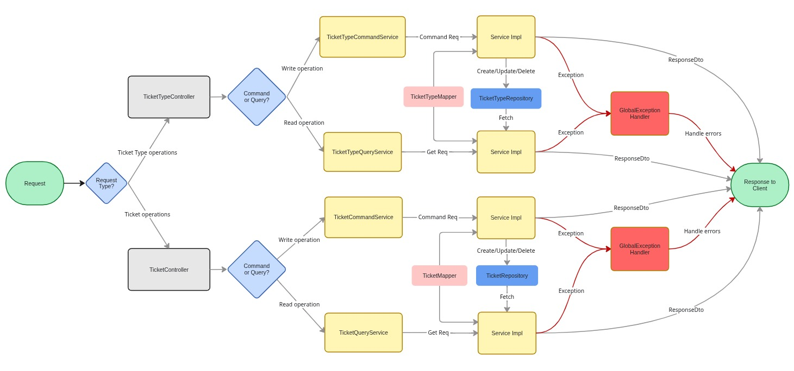

# Ticket Service — EventManagment Microservice

The **Ticket Service** is a dedicated **microservice** within the Event ecosystem that handles **all ticket-related operations**. It provides backend API for **creating, managing, and selling tickets** for events.

---

## Features

- **Manage Tickets:** Create, update, and retrieve tickets for events.
- **Ticket Types:** Supports multiple types per event (VIP, Regular, Student, etc.).
- **Availability Tracking:** Keeps track of available vs. sold tickets .



---

## Database Design

The **Ticket Service database** tracks tickets and ticket types. It works closely with the Event microservice to link tickets to their respective events.

Key entities:

- `Ticket`: Individual tickets purchased by users.
- `TicketType`: Defines categories, price, and available count.

###[ Architecture diagrams ](https://miro.com/welcomeonboard/czVOSUJvdDFuVm1NcXZtS29wZEc0SmFWTUVXemgxZTdETURCUDhsWGdyRDBMUUNHVWJCckNoS3l6Sjlkc3g4dnE4VnNTU1VWRWNpcmJQVVdyTXBqUHprZ0kzUnRKRWh0Nm1RNi9IakE0V2tqMU9zdDVIMlRuZVR4L0RsbTlIa2VNakdSWkpBejJWRjJhRnhhb1UwcS9BPT0hdjE=?share_link_id=315624819253)

###[ Microservice Design ](https://miro.com/welcomeonboard/czVOSUJvdDFuVm1NcXZtS29wZEc0SmFWTUVXemgxZTdETURCUDhsWGdyRDBMUUNHVWJCckNoS3l6Sjlkc3g4dnE4VnNTU1VWRWNpcmJQVVdyTXBqUHprZ0kzUnRKRWh0Nm1RNi9IakE0V2xNRmJZQXJKeEtBZGhGd0lpa2xaaHN3VHhHVHd5UWtSM1BidUtUYmxycDRnPT0hdjE=?share_link_id=689928873168)

---

## API Endpoints

Ticket-Types

| Method     | Endpoint                         | Description                        |
| ---------- | -------------------------------- | ---------------------------------- |
| **GET**    | `/ticket-types`                  | List all ticket types for an event |
| **GET**    | `/ticket-types/{ticket_type_id}` | Retrieve ticket type details       |
| **PATCH**  | `/ticket-types/{ticket_type_id}` | Update ticket type                 |
| **DELETE** | `/ticket-types/{ticket_type_id}` | Delete ticket type                 |

Tickets

| Method     | Endpoint              | Description                  |
| ---------- | --------------------- | ---------------------------- |
| **GET**    | `/ticket`             | List all tickets for a event |
| **GET**    | `/ticket/{ticket_id}` | Retrieve details of a ticket |
| **PATCH**  | `/ticket{ticket_id}`  | Update ticket info           |
| **DELETE** | `/ticket{ticket_id}`  | Delete a ticket of a event   |

---

## 🧩 Tech Stack

- **Backend:** Spring Boot (Java 17+)
- **Build Tool:** Gradle
- **Database:** PostgreSQL
- **Containerization:** Docker
- **Auth:** JWT-based Authentication
- **Deployment:** Dockerized microservice setup (Planned)

---

## ⚙️ Running Locally

Requirements:

- Java 17+
- Gradle (wrapper included)
- PostgreSQL running locally

Steps:

```bash
# 1️⃣ Clone repo
git clone https://github.com/mukuldaroch/ticket-service.git
cd eventforge

# Build container

docker compose up -d

# Run docker

docker compose up

# 3️⃣ Build project

./gradlew clean build

# 4️⃣ Run microservice

./gradlew clean bootrun

```

---

## Future Plans

- Payment gateway integration (Stripe/Razorpay)
- QR code generation & validation for tickets
- Email confirmation for purchased tickets
- Real-time analytics for ticket sales

---

## Contributing

Open issues, suggest features, or submit PRs — all contributions welcome.
Help make Ticket Service the **core of EventManagment ticketing system**.

---

## 👨‍💻 Author

- [@Mukul Daroch](https://github.com/mukuldaroch)
